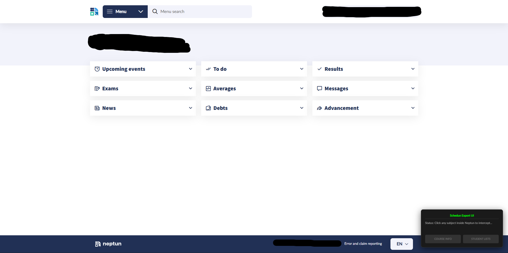

# Schedun
The official repository for the Schedun app.

## 📅 Semester
Until: 2026-12-14

## 🛠️ Functions
* **Schedule planning:** The main and best function of this software is that it can create many separate schedules based on the subjects you pick, you can filter based on specific courses only(recommended, since many courses are only for specific students, like exam courses). You can also select the maximum amount of days you want to attend, the start and finishing time of every day, the number of results, you can add lunch break and set the search to find the most optimal schedule.
* **Teacher/Student Search:** This function allows the user to search for other students in the university, and see their schedule. This only works if the student list excel files are downloaded for each course that the other student is in. Recommended usage is downloading all courses for the necessary classes in the semester. These need to be downloaded one by one for each course under the classes. Working on a method to speed this process up.
<br> 

## 💵 Pricing
The license key for the software costs 2.500 HUF(VAT 27% not included) for a semester, which is less than a 500 HUF a month. The semester for this software starts at the beginning of one exam period, and ends at the start of the next one, regardless of buying date. [CHECK SEMESTER](https://github.com/SchedunApp/Schedun#-semester)<br>
There are no free trials, demos or such. It took a lot of time, and it costs money to maintain, so we cannot afford releasing any of the features for free.

## 💳 Payment
The payments are still not fully developed, however this will be most likely through Revolut, with necessary fields in the comments, such as:
- Name
- University e-mail address(necessary, I can only provide this for specific universities, this might expand further later on if there is demand, you will get your license to your mail)
- University(BME/ELTE/ÓE, only available for these three for now, as I am only able to look into these universities)
Payments will be manually processed for now, so there might be some time between the customer buying the license, and our team processing it. 

## 📖 Setup Guide

### Step 0: License Activation
When you receive your license key, **make sure to enter it on your own primary computer**. The moment you activate it, the license binds to that specific hardware. You will not be able to use the same key on a different device later (e.g., a friend's laptop or a university computer).

### Step 1: Getting Neptun Data (Using the Script)
> [!NOTE]
> The script has been approved by one of the ÓE Neptun admins as legal, there was also another e-mail sent to the developer team of Neptun, currently awaiting answer. If you don't feel safe about using the script, feel free to review it before using.
#### A: Installing the script
Install the "Schedun Export Helper" script, by copying the contents of the script.txt file(not up yet, will be when this is official), download Tampermonkey from the [Official Site](https://www.tampermonkey.net/)(you will have to enable user scripts in the extension settings to use Tampermonkey), click add new script, then select everything, and replace it with the copied script. 
#### B: Using the script
Enter the Neptun page of your University, once it's the official Neptun page, a small window should appear in the bottom right of your screen. To install the course info easily(list of courses for a specific subject), got to "Menu -> Subject -> Register for subject", here Search for the subjects you want "recommended to filter by "Recommended term" for faster results", click the subject to open it's dropdown menu, now the small window should display the Subject name, the number of it's courses, and the options to download the course list(for schedule planning) and the student list(for student schedule searching). The course info downloading doesn't send any requests, it parses the info from the subject you opened(if you open another subject, you can't download the previous one by closing and opening it again, you have to reload the page). As for the Student list, it sends one request per course, because of this, there is a request speed limit set, so that it doesn't look like a DOS attack downloading 10+ or 100+ files at once. It is recommended to set the download location of the browser to a specific folder temporarily if you do this in a large quantity.
<br>

### Step 2: Importing Neptun Data (In the "Exports" Folder)
To use any of the core functions (Teacher Search, Student Search, Schedule Planner), you need to place your exported Excel files from Neptun into the correct folders. Downloading these files are to be done by the users themselves, however I'm working on a method to make this process easier.

## 📋 Instructions

### Step 1: Setting up folder structure
Create a folder named **`Exports`** in the exact same directory as your `.exe` file, and set up the following folder structure:

```text
📂 [Your Application Folder]
 ┣ 📄 Schedun.exe
 ┗ 📂 Exports
     ┣ 📂 Teacher   <-- Excel files for Teacher search
     ┣ 📂 Students  <-- Excel files for Student search
     ┗ 📂 Schedule  <-- Excel files for Schedule planning
```

### Step 2: Using the software
After loading the files inside the folders, open the application, and click the "Refresh Database" button for both the Teacher and Student tab. After this, you will be able to search in either category.
To visualize the schedule of someone, select all of their classes in the list(by selecting the first, then shift+click the last, or one by one holding ctrl), then click "Visualize Selected".

As for the Schedule planner, here is a detailed explanation on everything:
Left side:
- Refresh List button: Simply refreshes the list in case modifications were made to the files in the folder, and removes all selection.
- Subject List: A big square, in which the Subjects, and their Courses appear, and can be selected
- Filters:
    - Max. Days: Sets the maximum days you want to attend University(without skipping classes)
    - Earliest start: Sets the time at which you want to start your classes earliest at in the University every day(individual filter is in plan)
    - Latest end: Sets the time at which you want to end your classes latest at in the University every day(individual filter is in plan)
    - Max. schedules Shown: The maximum number of results displayed.
- Generate Schedules button: This button starts the process of generating the schedules. In case of fast planning, or few courses, it is done in a few seconds at most.

Middle part:
- Top part: Displays the total possible class variations, and progress
- Rest of the middle: Displays all results visually

Right side(advanced filters):
- Lunch break filter: Allows user to include a lunch break each day, between classes(needs more than one class a day)
- Schedule optimization: Increases time taken by the software to plan by a lot, in exchange it tries to create the most optimal and perfect schedule.
    - Compact: Might result in classes from morning until night, all day long
    - Balanced: Tries to avoid too many classes in a single day, spreads them evenly across multiple days(make sure to limit your maximum days)

## 🎯 Future plans, ideas
* **Phone version for the Search app:** An iPhone version is currently under development, it's close to being presentable. Too many issues arose with Android so far, not gonna be developed there in the near future.
* **Schedule optimalization button:** A button that at the cost of a much slower runtime, plans a schedule with the smallest possible breaks between classes. ✅
* **Excel download helper software:** A software that speeds up the process of downloading the excel files. Process most likely cannot be fully automated due to the risk of it being against university rules. ✅
* **Lunch Break:** The option to implement a 20-30 minute long lunch break between classes. ✅
* **Installer:** A better looking installer to add(and remove) the app properly to/from the application list, not just a runnable exe on the computer somewhere. Also sets up the necessary folder structure. **For now this function is not in focus, as everything works just fine without this too.**
* **Better responses:** Proper, detailed explanation when Schedule planning doesn't find a working schedule. ✅
* **Favorited:** A function to add specific names to the favorites, able to access their schedules fast. **This function is still not fully planned out.**
* **External University Friends:** Might add on demand, allows users to add the schedules of their friends from other universities specificly. **This function is still not fully planned out.**
* **Common classes:** Allows users to search for and select multiple people, and check what classes they attend together.
* **Individual daily filter:** A feature that allows users to set for each day their earliest and latest start.

## 🌐 Contact Information
If you have any issues with the app, any questions or suggestions, feel free to contact us at: schedunapp@gmail.com
