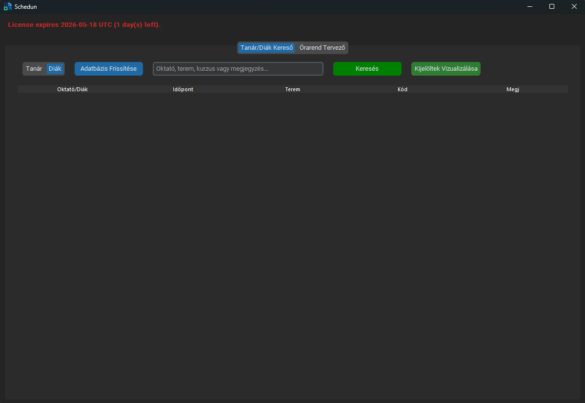
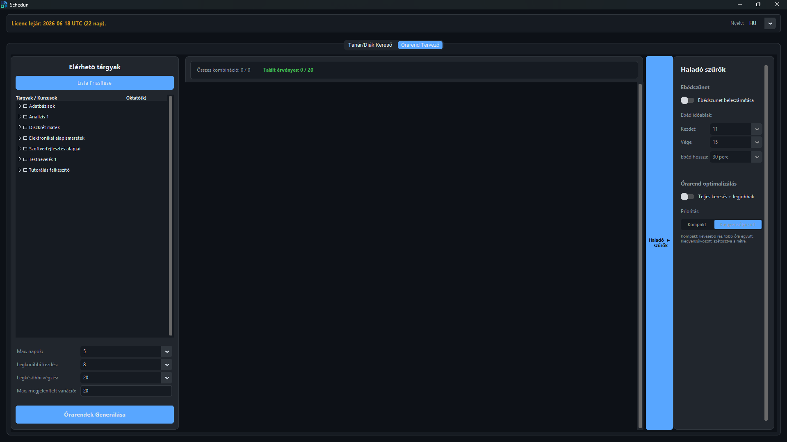

# Schedun
The official repository for the Schedun app. Downloading it is free, using it is paid

## ⚠️ Important Disclaimer

*   **Antivirus False Positive:** If you are using Windows Defender, it might flag the `.exe` file as **Trojan:BadJoke**, as reported by testers. Other antiviruses don't seem to do the same.
*   **Why is this happening?** The application code is heavily encrypted to protect intellectual property and does not have an expensive official digital signature. Since Windows cannot "look inside" the encrypted file, it takes the safest route and flags it.
*   **Safety:** The application is **100% safe and virus-free**. The file has been thoroughly scanned with **Kaspersky**, and no threats were found. You can safely add an exclusion/exception for the app in Windows Defender, or just simply choose no action taken when prompted. All files used by this project can be obtained legally.

## 💵 Pricing
The software costs 5.000 HUF for a semester, which is less than a 1.000 HUF a month. The semester for this software starts at the beginning of one exam period, and ends at the start of the next one, regardless of buying date.

## 🛠️ Functions
* **Schedule planning:** The main and best function of this software is that it can create many separate schedules based on the subjects you pick, you can filter based on specific courses only(recommended, since many courses are only for specific students, like exam courses). You can also select the amount of days you want to attend, the start and finishing time of every day and the number of variations created.
* **Teacher/Student Search:** This function allows the user to search for other students in the university, and see their schedule. This only works if the student list excel files are downloaded for each course that the other student is in. Recommended usage is downloading all courses for the necessary classes in the semester. These need to be downloaded one by one for each course under the classes. Working on a method to speed this process up.
<br> 

## 📋 Instructions & Setup Guide

### Step 1: License Activation
When you receive your license key, **make sure to enter it on your own primary computer**. The moment you activate it, the license binds to that specific hardware. You will not be able to use the same key on a different device later (e.g., a friend's laptop or a university computer).

### Step 2: Importing Neptun Data (The "Exports" Folder)
To use any of the core functions (Teacher Search, Student Search, Schedule Planner), you need to place your exported Excel files from Neptun into the correct folders. Downloading these files are to be done by the users themselves, however I'm working on a method to make this process easier.

Create a folder named **`Exports`** in the exact same directory as your `.exe` file, and set up the following folder structure:

```text
📂 [Your Application Folder]
 ┣ 📄 Schedun.exe
 ┗ 📂 Exports
     ┣ 📂 Teacher   <-- Excel files for Teacher search
     ┣ 📂 Students  <-- Excel files for Student search
     ┗ 📂 Schedule  <-- Excel files for Schedule planning
```

## 🎯 Future plans
* **Phone version for the Search app:** An iPhone version is currently under development, it's close to being presentable.
* **Schedule optimalization button:** A button that at the cost of a much slower runtime, plans a schedule with the smallest possible breaks between classes.
* **Excel download helper software:** A software that speeds up the process of downloading the excel files. Process most likely cannot be fully automated due to the risk of it being against university rules.

## 🌐 Contact Information
If you have any issues with the app, any questions or suggestions, feel free to contact me at: schedunapp@gmail.com
